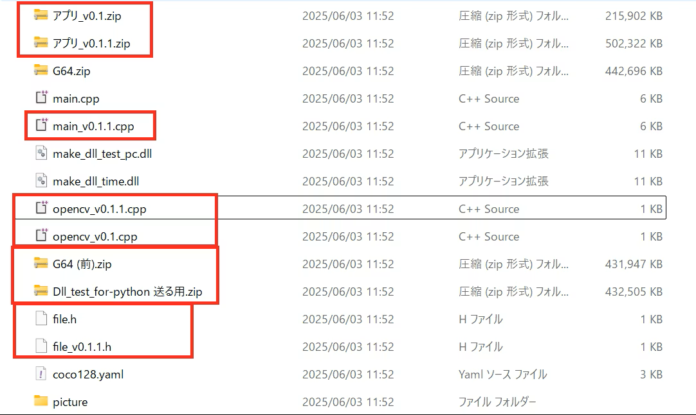
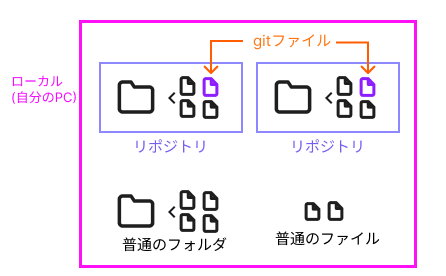
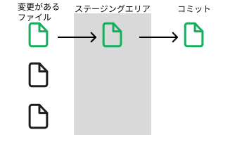
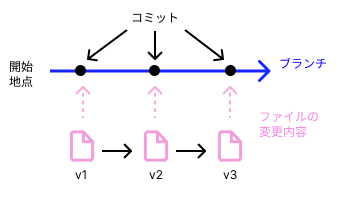
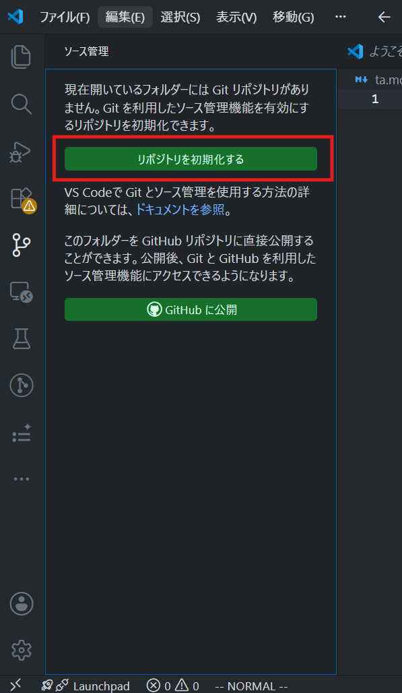

# Gitレベル1講座
---

## まずインストール！

しのごの言わずにまずはインストールしよう！

---

### インストール手順(windows向け)

- Gitのインストール方法 というQiita記事を参考に進めます
- https://qiita.com/takeru-hirai/items/4fbe6593d42f9a844b1c

## 
- こっちも参照
- https://www.sejuku.net/blog/73444#index_id1

---

### 拡張機能

- Git Graph

コードの行に対して、誰が変更したか分かるようになるのが便利
(チーム開発になった時にぜひ)

---

## 今回の講座の目的

---

## エンジニアの必須ツール、Git

Gitを使える開発とそうでない開発
この差は天と地ほど違います

Gitを使えない開発とか
もはや拷問

---

Gitを知らないエンジニアとかね、全く話にならないです

スキーで例えるとストック知らないみたいなレベルです
料理で例えると包丁知らないレベルです

**最低限の知識を確実に付けてもらいます！**

---

## Gitって？

**バージョン管理システム**です！

---

### バージョン管理？

ゲームとかってバージョンあるよね？
そのバージョンです

---

### 何がいいのか？

---

プログラムしたファイルを更新する時、前の状態を残しておきたいなと思う事がよくあります。

最新のコードにしたけどやっぱりバグあったから戻したい...

---

そんな時にしてるのがバージョン管理！

---

### 悲惨！

これでもマシな方かも...



---

たまにネットでも、

- 最新版.xlsx
- 最終盤.xlsx
- 最新版コピー.xlsx
- 最新版コピー(1).xlsx

みたいなのが話題になってたり

---

こんな状態に対処しよう！


というのがGitなんですね

---

## 具体的にどうするか

---

バージョン管理の主な手法

- **ファイルの変更を記録**して履歴に残しておく
 ファイルの履歴を呼ぶ事で、その地点でのファイルに戻せたりする。

## 
> 変更とは？
新規の記述、コードの変更、削除のこと

---

## リポジトリ

Gitで管理するフォルダの事



---

## アド

**ステージング**

記録に残すファイルを決定する操作です



---

## コミット

ステージングエリアにある変更を記録する操作です



---

## ブランチ

履歴の流れみたいなもん

今は置いておきます

---

## やっとこさ実践

---

## 演習

---

## リポジトリ作成



---


### アドしよう

- ファイルを2つ作ろう
- それぞれ異なる事を書いてみよう

- 片方のファイルをステージングしよう

---

### addの操作

- コマンド
```
add
```

- VSCode
https://qiita.com/OMOCHInoHOSHI/items/2de8994dc1b95b1a9b0d#%E3%82%A2%E3%83%89-1

---


### コミットしよう

- コミットメッセージを書こう
- コミットしてみよう

---

### コミットの操作

- コマンド
```
commit
```

- VSCode
 コミットボタン

---


## ファイル変更

テケトーにファイルを変更してみましょう

---


## GitHubとは？

---

**Gitのホスティングサービス**

GitHub以外にもあるけど、一番よく使われるのはGitHub

---

Gitのリポジトリをネットに保存&共有ができるサイト

公開設定ができるGoogleDriveみたいなもんです

---

## GitとGitHubは別物です！！！！

Git    --> バージョン管理ツール

GitHub --> Gitを円滑に使うためのWebサービス

## 
ここだけでも覚えて!

---


---


---

時間があったら

---

## ブランチ

---

- 異なる世界線を用意する
 ファイルAに対して、関数Add(x,y)を記述した世界線
 ファイルAに対して、関数Sub(x,y)を記述した世界線

---
